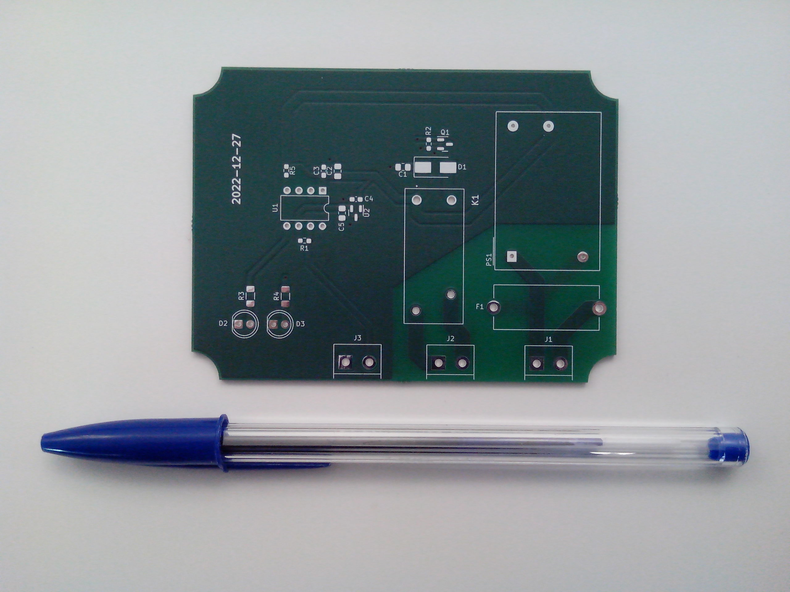
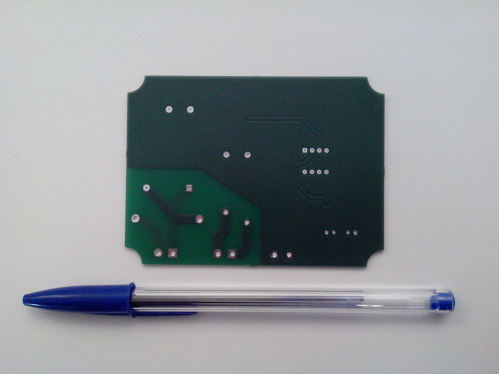
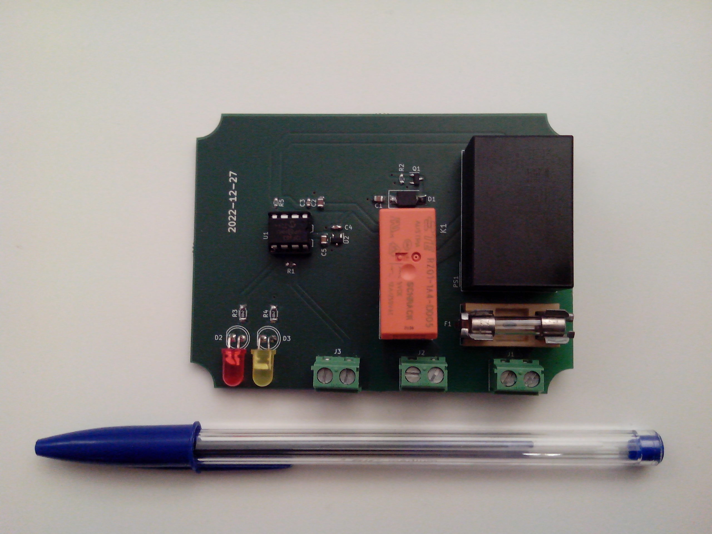
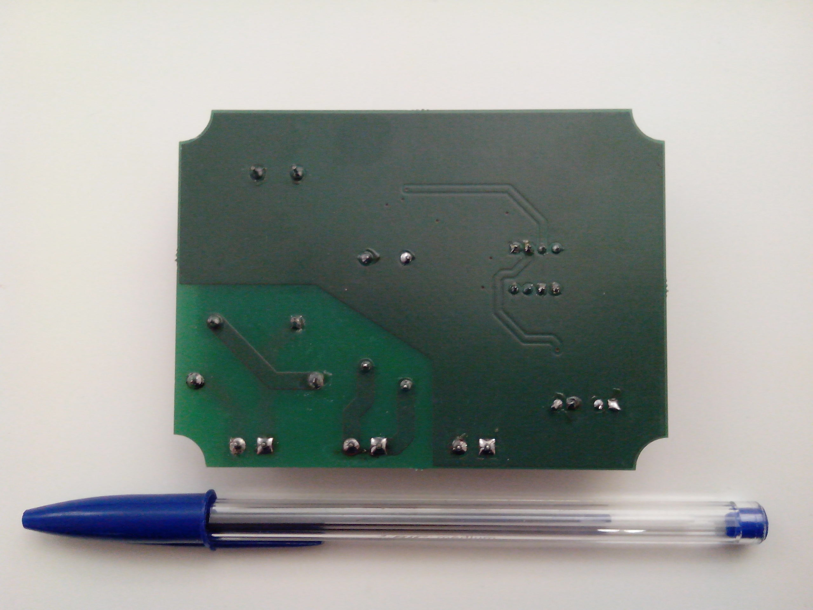
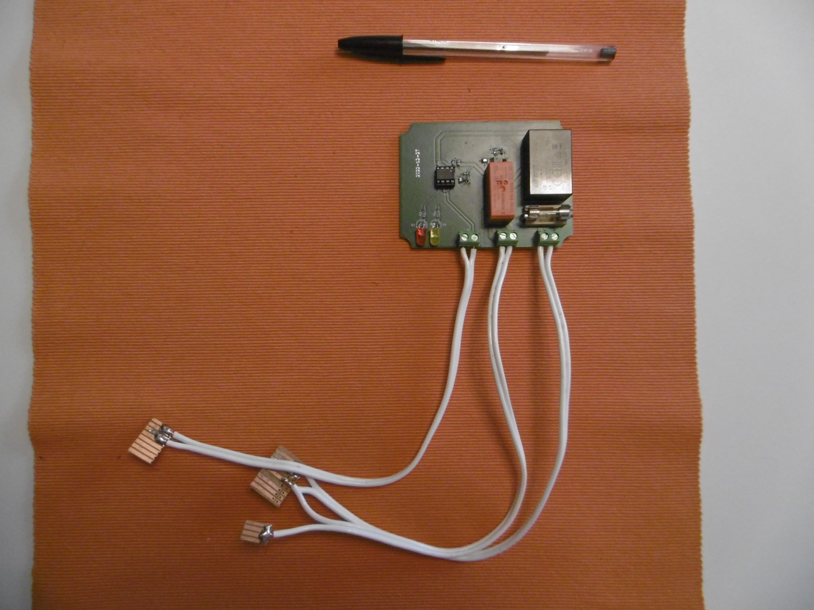
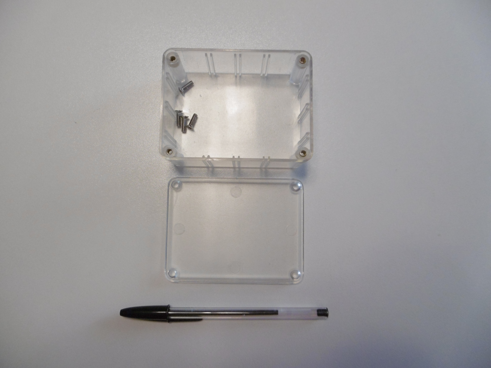
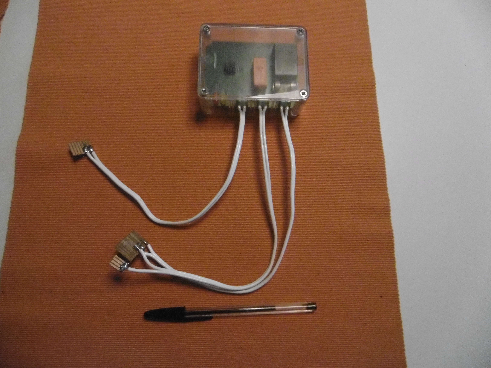
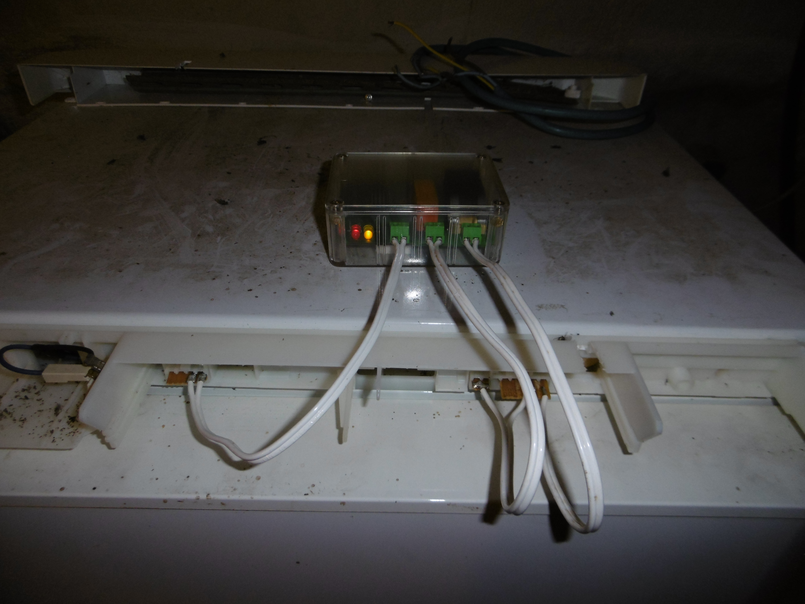

# Fridge controller

A very simple controller with a light electronic BoM. It manages the fridge temperature with hardcoded thresholds and hysteresis.

## Photo gallery

Naked PCB :

Assembled PCB :

Connector adapters for the targeted freezer :

Transparent plastic casing (reference Deltron 479-0160-0) :

Board inside the casing with drilled holes and connector adapters :

The board controlling the freezer in a basement :

