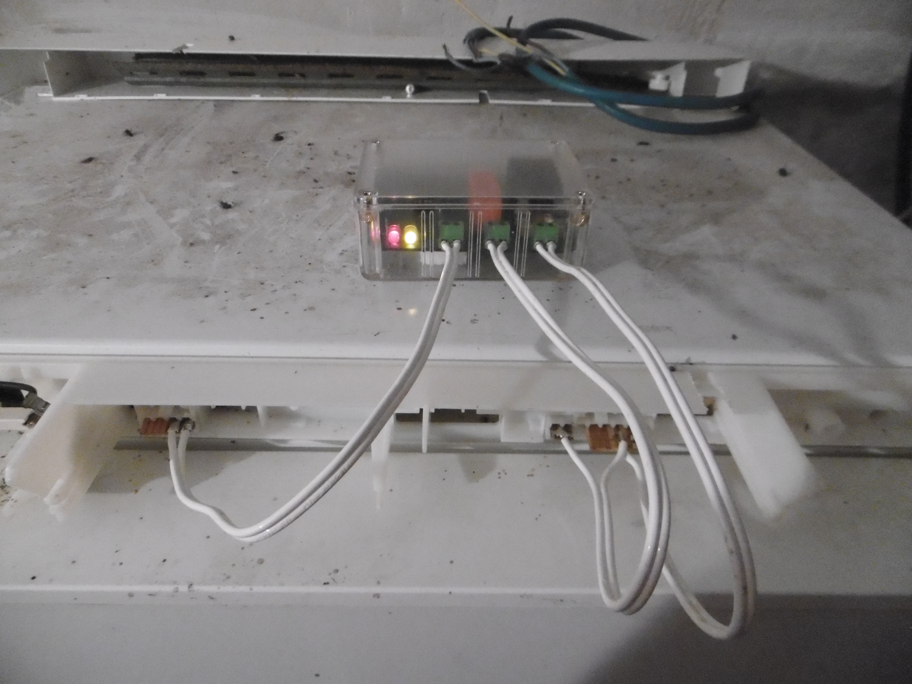

# Fridge controller

A very simple controller with a light electronic BoM. It manages the fridge temperature with hardcoded thresholds and hysteresis.

## Project information

The board is powered by a PIC12F683 MCU. It samples the fridge or freezer temperature through a NTC sensor. It then controls the fridge cold unit through a 230V/12A relay.

### Hardware

The board schematic and PCB are designed with KiCad 6.

### Firmware

The microcontroller firmware is compiled with the free version of Microchip XC8 compiler.

## Photo gallery

Naked PCB :

Assembled PCB :

Connector adapters for the targeted freezer :

Transparent plastic casing (reference Deltron 479-0160-0) :

Board inside the casing with drilled holes and connector adapters :

The board controlling the freezer in a basement :

## Technical information about the Brandt UD2321 freezer

The following information have been found through reverse engineering, so be careful about their accuracy !  

The picture below shows the connector names (the names are taken from the original controller board PCB).  
There were no indications on the PCB of the pin numbers, so I assigned them myself.

Connector CN1 signals :
| Pin number | Description             |
| ---------- | ----------------------- |
| 1          | Not connected           |
| 2          | Not connected           |
| 3          | Original controller GND |
| 4          | NTC (thermal sensor)    |

Connector CN2 signals :
| Pin number | Description          |
| ---------- | -------------------- |
| 1          | Cold unit (note 1)   |
| 2          | Cold unit (note 1)   |
| 3          | Not connected        |
| 4          | Not connected        |
| 5          | Door switch (note 2) |
| 6          | 230V neutral         |
| 7          | Door switch (note 3) |
| 8          | 230V live            |

Notes :
1. Connect CN2 pins 1 and 2 to neutral to start the cold unit.
2. Door switch contact is normally closed.
3. CN2 pin 7 is connected the 230V live on the original controller board.

Connector CN3 is not populated.
